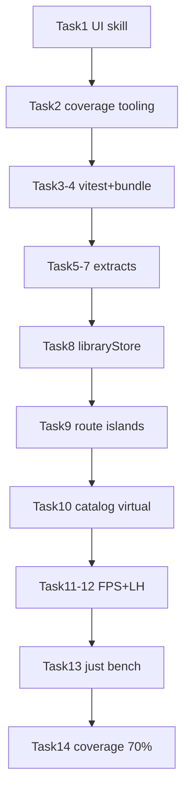

# Quality, Perf, UI Guidelines & Benchmarks Implementation Plan

> **For agentic workers:** REQUIRED SUB-SKILL: Use superpowers:subagent-driven-development (recommended) or superpowers:executing-plans to implement this plan task-by-task. Steps use checkbox (`- [ ]`) syntax for tracking.
>
> **Subagent split:** One fresh implementer subagent per task below; task review after each; no parallel implementers (shared files). Prefer cheap/fast models for Tasks 1–4, 11–13; standard for 5–10, 14; most capable for final whole-branch review.

**Goal:** Land project UI skill/rule, coverage≥70% lines on `src/**`, Vitest+bundle+Playwright FPS+Lighthouse benches, extract hotspots, `useSyncExternalStore` library selectors + App route islands, and catalog list virtualization — without breaking schema/patch/DnD invariants.

**Architecture:** Tooling-first. Pure extractions before render isolation. Catalog virtualizes with `@tanstack/react-virtual` on `.catalog-list`; tier DnD stays non-virtual. Library reads go through an external store + `useLibrarySelector`.

**Tech Stack:** React 19, Vite 8, Vitest 4 (+ coverage-v8), `@tanstack/react-virtual`, Playwright, Lighthouse, existing domain/state.

**Spec:** [docs/superpowers/specs/2026-07-22-quality-perf-benchmarks-design.md](../specs/2026-07-22-quality-perf-benchmarks-design.md)

## Global Constraints

- Schema **v2** exact entity key sets; no patch/publish semantic changes.
- Browser patch metadata-only (`blobs: {}`); SHA-256 assets; published assets immutable.
- RU UI copy; HashRouter routes unchanged (`/`, `/games`, `/games/:id`, `/settings`).
- **No tier or notes virtualization.** Tier `@dnd-kit` behavior unchanged.
- Coverage gate: **≥ 70% lines** on `src/**` (enabled in final coverage task; tooling lands earlier report-only).
- FPS/Lighthouse: **report-only** (non-zero exit only on harness crash).
- Prefer project UI skill over `using-ui-stack` in this repo.
- VCS: `git`; work on branch `chore/quality-perf-benchmarks` (create in Task 0); commit after each task with HEREDOC message.
- Do not push unless human asks.
- Verify: targeted tests → `npm test` → (if data shape) `npm run data:validate` → before done `npm run test:coverage` + `npm run build`.

## File map

| Path | Role |
|------|------|
| `docs/agent/mygameslist-ui/*` | Tracked UI skill/rule mirror |
| `.cursor/skills/mygameslist-ui/*`, `.cursor/rules/mygameslist-ui.mdc` | Local agent copies |
| `vite.config.ts`, `package.json`, `Justfile` | Coverage + bench scripts |
| `benchmarks/**` | Bench runners, fixtures, README; `results/` gitignored |
| `src/state/libraryPatchHelpers.ts`, `libraryAssets.ts` | Extracted from LibraryContext |
| `src/state/libraryStore.ts` | External store + selectors |
| `src/state/LibraryContext.tsx` | Provider publishes to store |
| `src/pages/gameNotes.ts` | Pure note helpers from GamePage |
| `src/App/diffModel.ts` | Diff/field helpers from App |
| `src/App/routeIslands.tsx` | Memoized Catalog/Tier/Game islands |
| `src/pages/CatalogPage.tsx` | Virtualized list |
| `src/components/CatalogVirtualList.tsx` | Virtual window component |
| `tests/**` | New + updated coverage |



---

### Task 0: Branch + ignore results

**Files:**
- Modify: `.gitignore`
- Branch: `chore/quality-perf-benchmarks`

**Interfaces:** none

- [ ] **Step 1: Create branch from main**

```bash
git checkout main
git pull --ff-only || true
git checkout -b chore/quality-perf-benchmarks
```

- [ ] **Step 2: Ignore bench artifacts**

Append to `.gitignore`:

```
benchmarks/results/
```

- [ ] **Step 3: Stage approved spec if untracked + commit**

```bash
git add .gitignore docs/superpowers/specs/2026-07-22-quality-perf-benchmarks-design.md
git commit -m "$(cat <<'EOF'
docs: approve quality/perf/benchmarks design

Track the approved spec and ignore benchmark result artifacts.
EOF
)"
```

---

### Task 1: UI skill + rule (tracked + local)

**Files:**
- Create: `docs/agent/mygameslist-ui/SKILL.md`
- Create: `docs/agent/mygameslist-ui/tokens.md`
- Create: `docs/agent/mygameslist-ui/rule.md`
- Create: `.cursor/skills/mygameslist-ui/SKILL.md` (copy)
- Create: `.cursor/skills/mygameslist-ui/tokens.md` (copy)
- Create: `.cursor/rules/mygameslist-ui.mdc` (from rule.md + frontmatter)

**Interfaces:**
- Produces: agent-readable UI guidelines matching `src/styles.css` tokens

- [ ] **Step 1: Write `docs/agent/mygameslist-ui/tokens.md`**

```markdown
# mygameslist design tokens

Source of truth: `src/styles.css` `:root` and `:root[data-theme="light"]`.

## Surfaces
`--bg`, `--surface`, `--surface-2`, `--surface-3`, `--field`

## Text
`--text`, `--muted`, `--muted-2`

## Accent / semantic
`--accent`, `--accent-strong`, `--accent-wash`
`--danger`, `--warning`, `--success`

## Chrome
`--line`, `--line-soft`, `--header-bg`, `--overlay-bg`, `--elevated-bg`
`--glass-fill`, `--glass-stroke`
`--hover-wash`, `--hover-wash-strong`, `--press-wash`
`--shadow`

## Controls
`--control-height: 30px`
`--control-pad-x: 10px`
`--control-radius: 5px`
`--touch-target: 44px`
`--radius: 6px`

## Buttons
`--btn-primary-*`, `--btn-secondary-*`, `--btn-danger-*` (fg/bg/border + hover/active)

## Typography
System stack: `-apple-system, BlinkMacSystemFont, "SF Pro Text", "Helvetica Neue", "Segoe UI", sans-serif`
Body ~13px / line-height 1.4. Dense personal-library UI — not marketing landing.

## Themes
Default dark. Light via `data-theme="light"`. Every new color needs both themes.
```

- [ ] **Step 2: Write `docs/agent/mygameslist-ui/SKILL.md`**

```markdown
---
name: mygameslist-ui
description: >-
  Project UI guidelines for mygameslist — dark-first CSS tokens, dense RU library
  chrome, BEM-ish classes, button/control patterns. Use when editing pages,
  components, styles.css, or CSS regression tests. Prefer over using-ui-stack
  in this repo.
---

# mygameslist UI

Read [tokens.md](tokens.md) before adding colors or control sizes.

## Do

- Use CSS variables from tokens.md — never invent one-off hex for new UI without light/dark pairs.
- Reuse classes: `button button--primary|secondary|danger`, `app-shell`, `catalog-list`, `empty-state`, `form-card`, `filter-menu`.
- Keep density; RU product strings consistent with existing copy.
- Motion ≤300ms; wrap/honor `prefers-reduced-motion`.
- Touch targets ≥ `--touch-target` (44px) for primary mobile hit areas.
- Extend existing mobile chrome (tab bar, swipe pager, screen filter bar) — do not fork nav.
- CSS/layout changes: add/extend `tests/*-css.test.ts` when that is the local norm.

## Do not

- Apply generic `using-ui-stack` 8px/Tailwind/purple defaults here.
- Build marketing heroes, stat strips, or decorative cards.
- Put business rules only in components (domain → state → UI).
- Change schema/patch/publish paths for cosmetic work.

## frontend-design skill

Only for net-new marketing surfaces (none in-app today). In-app chrome → this skill.
```

- [ ] **Step 3: Write `docs/agent/mygameslist-ui/rule.md` body + `.cursor/rules/mygameslist-ui.mdc`**

`.cursor/rules/mygameslist-ui.mdc`:

```markdown
---
description: mygameslist UI — use project tokens/classes, not generic UI stacks
globs: src/pages/**/*,src/components/**/*,src/styles.css,tests/*-css.test.ts
alwaysApply: false
---

# mygameslist UI

Follow `docs/agent/mygameslist-ui/SKILL.md` (and `.cursor/skills/mygameslist-ui/` if present).

- Colors/spacing/controls: CSS vars in `docs/agent/mygameslist-ui/tokens.md` / `src/styles.css`
- No new raw hex unless mirrored in dark + `data-theme="light"`
- Prefer existing BEM-ish classes over new design systems
- RU copy; dense layout; no marketing chrome
```

Copy skill+tokens into `.cursor/skills/mygameslist-ui/`. Copy rule body into `docs/agent/mygameslist-ui/rule.md` (same content without needing globs).

- [ ] **Step 4: Commit**

```bash
git add docs/agent/mygameslist-ui
git add -f .cursor/skills/mygameslist-ui .cursor/rules/mygameslist-ui.mdc 2>/dev/null || true
git status
# If .cursor is ignored and -f fails for userignore, commit docs/agent only and note in commit body.
git commit -m "$(cat <<'EOF'
docs(agent): add mygameslist UI skill and rule

Encode real CSS tokens and dense library chrome so agents stop applying generic UI stacks.
EOF
)"
```

---

### Task 2: Coverage tooling (report-only threshold)

**Files:**
- Modify: `vite.config.ts`
- Modify: `package.json`
- Create: (ensure) `@vitest/coverage-v8` as devDependency if missing

**Interfaces:**
- Produces: `npm run test:coverage`

- [ ] **Step 1: Install coverage provider if needed**

```bash
npm install -D @vitest/coverage-v8
```

- [ ] **Step 2: Configure Vitest coverage in `vite.config.ts`**

```ts
test: {
  environment: "jsdom",
  globals: true,
  setupFiles: ["./src/test/setup.ts"],
  coverage: {
    provider: "v8",
    reporter: ["text", "html", "json-summary"],
    reportsDirectory: "./coverage",
    include: ["src/**/*.{ts,tsx}"],
    exclude: [
      "src/test/**",
      "src/vite-env.d.ts",
      "src/main.tsx",
    ],
    // Report-only until Task 14 fills gaps:
    thresholds: undefined,
  },
},
```

- [ ] **Step 3: Add script**

In `package.json` scripts:

```json
"test:coverage": "vitest run --coverage"
```

- [ ] **Step 4: Run once (must exit 0)**

```bash
npm run test:coverage
```

Expected: coverage report printed; may be &lt;70% — OK this task.

- [ ] **Step 5: Commit**

```bash
git add package.json package-lock.json vite.config.ts
git commit -m "$(cat <<'EOF'
chore(test): wire Vitest v8 coverage report

Add test:coverage script and include src/** for later 70% gate.
EOF
)"
```

---

### Task 3: Vitest domain/filter benches + fixture generator

**Files:**
- Create: `benchmarks/fixtures/generateGames.ts`
- Create: `benchmarks/vitest/domain.bench.ts`
- Create: `benchmarks/README.md` (initial section)
- Modify: `package.json` (`"bench": "vitest bench --run benchmarks/vitest"`)
- Modify: `vite.config.ts` if bench path needs include

**Interfaces:**
- Produces: `generateGames(count: number, seed?: number): Game[]` deterministic
- Produces: `npm run bench`

- [ ] **Step 1: Write failing/empty bench file that imports generator**

`benchmarks/fixtures/generateGames.ts`:

```ts
import { TIER_IDS, STATUS_IDS, type Game, type StatusId, type TierId } from "../../src/domain/types";

function mulberry32(seed: number): () => number {
  return () => {
    seed |= 0; seed = seed + 0x6D2B79F5 | 0;
    let t = Math.imul(seed ^ seed >>> 15, 1 | seed);
    t = t + Math.imul(t ^ t >>> 7, 61 | t) ^ t;
    return ((t ^ t >>> 14) >>> 0) / 4294967296;
  };
}

export function generateGames(count: number, seed = 1): Game[] {
  const rnd = mulberry32(seed);
  const games: Game[] = [];
  for (let i = 0; i < count; i += 1) {
    const id = `bench-${String(i).padStart(5, "0")}`;
    const status = STATUS_IDS[Math.floor(rnd() * STATUS_IDS.length)] as StatusId;
    const tierId = TIER_IDS[Math.floor(rnd() * TIER_IDS.length)] as TierId;
    const updatedAt = new Date(1_700_000_000_000 + i * 60_000).toISOString();
    games.push({
      id,
      title: `Bench Game ${i}`,
      status,
      platforms: rnd() > 0.5 ? ["PC"] : ["PC", "PS5"],
      tags: rnd() > 0.5 ? ["action"] : ["rpg", "indie"],
      coverAssetId: null,
      steamAppId: null,
      importedVia: null,
      hoursPlayed: null,
      reviewMarkdown: "",
      placement: { tierId, rank: (i + 1) * 1024 },
      createdAt: updatedAt,
      updatedAt,
    });
  }
  return games;
}
```

Verify `Game` fields against `src/domain/types.ts` — adjust to exact required keys if types differ.

- [ ] **Step 2: Write `benchmarks/vitest/domain.bench.ts`**

```ts
import { bench, describe } from "vitest";
import { gameMatchesFilters } from "../../src/domain/catalogue";
import { generateGames } from "../fixtures/generateGames";

describe("catalog filter pipeline", () => {
  const games = generateGames(2000);
  bench("filter+sort 2000 games query=bench", () => {
    games
      .filter((game) => gameMatchesFilters(game, { query: "bench", statuses: [], tiers: [], platforms: [], tags: [] }))
      .sort((left, right) => right.updatedAt.localeCompare(left.updatedAt));
  });
});
```

Add at least one more bench calling `applyPatch`/`reconcilePatch` or `assertValidLibrary` on a tiny constructed `LibraryDatabase` if imports are straightforward; otherwise keep filter bench + a second filter facet bench.

- [ ] **Step 3: Wire script + run**

```bash
npm run bench
```

Expected: Vitest bench output, exit 0.

- [ ] **Step 4: README stub + commit**

`benchmarks/README.md` documents `npm run bench` purpose (report-only).

```bash
git add benchmarks package.json vite.config.ts
git commit -m "$(cat <<'EOF'
chore(bench): add Vitest domain/filter micro-benchmarks

Deterministic game fixtures and catalog filter pipeline timing.
EOF
)"
```

---

### Task 4: Bundle size script

**Files:**
- Create: `benchmarks/bundle/recordBundleSize.mjs`
- Modify: `package.json` (`"bench:bundle": "node benchmarks/bundle/recordBundleSize.mjs"`)
- Modify: `benchmarks/README.md`

**Interfaces:**
- Produces: writes `benchmarks/results/bundle.json`; exit 1 if `dist/` missing

- [ ] **Step 1: Implement recorder**

```js
import { mkdirSync, readdirSync, statSync, writeFileSync, existsSync } from "node:fs";
import { join } from "node:path";

const dist = new URL("../../dist/", import.meta.url);
const distPath = dist.pathname;
if (!existsSync(distPath)) {
  console.error("dist/ missing — run npm run build first");
  process.exit(1);
}

function walk(dir) {
  const entries = [];
  for (const name of readdirSync(dir)) {
    const path = join(dir, name);
    const st = statSync(path);
    if (st.isDirectory()) entries.push(...walk(path));
    else entries.push({ path: path.slice(distPath.length), bytes: st.size });
  }
  return entries;
}

const files = walk(distPath);
const totalBytes = files.reduce((sum, f) => sum + f.bytes, 0);
const result = { generatedAt: new Date().toISOString(), totalBytes, files: files.sort((a, b) => b.bytes - a.bytes) };
const outDir = new URL("../results/", import.meta.url);
mkdirSync(outDir, { recursive: true });
writeFileSync(new URL("bundle.json", outDir), JSON.stringify(result, null, 2) + "\n");
console.log(`bundle totalBytes=${totalBytes} files=${files.length}`);
```

Fix `distPath` for macOS (`fileURLToPath`) if needed:

```js
import { fileURLToPath } from "node:url";
const distPath = fileURLToPath(new URL("../../dist/", import.meta.url));
```

- [ ] **Step 2: Verify**

```bash
npm run build
npm run bench:bundle
test -f benchmarks/results/bundle.json
```

- [ ] **Step 3: Commit** (do not commit `benchmarks/results/`)

```bash
git add benchmarks/bundle package.json benchmarks/README.md
git commit -m "$(cat <<'EOF'
chore(bench): record Vite dist asset sizes

Fail if dist/ missing; write JSON under gitignored results/.
EOF
)"
```

---

### Task 5: Extract LibraryContext pure helpers

**Files:**
- Create: `src/state/libraryPatchHelpers.ts`
- Create: `src/state/libraryAssets.ts`
- Modify: `src/state/LibraryContext.tsx` (import from new modules; re-export `requiredLocalAssetIds`, `verifyPublishedLocalAssets`, `verifyAndDeletePublishedLocalAssets`)
- Test: existing `tests/library-context.test.tsx` must pass; add `tests/library-patch-helpers.test.ts` for pure fns if easy

**Interfaces:**
- Move **without behavior change** from `LibraryContext.tsx`:
  - `emptyPatch`, `uniqueStrings`, `maxRank`, `patchAssetMetadata`, `patchLocalAssetIds`, `requiredLocalAssetIds`, `patchUsage`, `garbageCollectReconciledAssets`, `samePublishedVersion` → prefer `libraryPatchHelpers.ts` (keep exports that tests import)
  - `assetFromPrepared`, `retainLocalAsset`, `preparedLocalAssets`, `localAssetsFromLegacyBlobs`, `verifyPublishedLocalAssets`, `verifyAndDeletePublishedLocalAssets` → `libraryAssets.ts`

- [ ] **Step 1: Move functions preserving signatures**

Re-export from `LibraryContext.tsx`:

```ts
export { requiredLocalAssetIds } from "./libraryPatchHelpers";
export { verifyPublishedLocalAssets, verifyAndDeletePublishedLocalAssets } from "./libraryAssets";
```

Or keep exporting from helpers and update test imports to new paths — either OK if `npm test` green.

- [ ] **Step 2: Run tests**

```bash
npx vitest run tests/library-context.test.tsx
npm test
```

- [ ] **Step 3: Commit**

```bash
git commit -m "$(cat <<'EOF'
refactor(state): extract library patch/asset helpers

Pull pure helpers out of LibraryContext for testability and smaller provider file.
EOF
)"
```

---

### Task 6: Extract GamePage note pure helpers

**Files:**
- Create: `src/pages/gameNotes.ts`
- Modify: `src/pages/GamePage.tsx` (re-export from `gameNotes` for back-compat **or** update test imports)
- Modify: `tests/note-groups.test.tsx` imports if needed

**Interfaces:**
- Move exported pure symbols currently at top of `GamePage.tsx`:
  - `noteGroupRank`, `groupDraftNotes`, `nextEmptyNoteGroupRank`, `moveDraftNoteToGroup`
  - `getImplicitNoteDropEdge`, `getNoteDropPlacement`, `getNoteDropIndex`
  - `NonTouchNotePointerSensor`, `NOTE_LIST_SENSOR_TYPES`, `noteKeyboardCoordinates`, `NOTE_LIST_SENSOR_OPTIONS`, `NOTE_LIST_SORTING_STRATEGY`, `noteListCollisionDetection`
  - Related types (`NoteDropEdge`, `EditableNoteGroup`, …) that only those helpers need

Leave React components in `GamePage.tsx` this task.

- [ ] **Step 1: Move + re-export**

```ts
// GamePage.tsx
export {
  noteGroupRank,
  groupDraftNotes,
  // ...all moved symbols
} from "./gameNotes";
```

- [ ] **Step 2: Tests**

```bash
npx vitest run tests/note-groups.test.tsx
npm test
```

- [ ] **Step 3: Commit**

```bash
git commit -m "$(cat <<'EOF'
refactor(pages): extract game note DnD helpers

Move pure note grouping/collision helpers out of GamePage.tsx.
EOF
)"
```

---

### Task 7: Extract App diff model

**Files:**
- Create: `src/App/diffModel.ts`
- Modify: `src/App.tsx` to import helpers
- Test: `tests/diff-model.test.ts` (new) covering `classifyDiff`, `assetSummary`, `entityName` with tiny fixtures

**Interfaces:**
- Move from `App.tsx`: `fieldLabels` (export), `entityName`, `classifyDiff`, `assetMeta`, `assetSummary`
- `entityName` should take `effective`/`base` `LibraryDatabase` slices, not `ReturnType<typeof useLibrary>`

Example signature:

```ts
export function classifyDiff(path: string, operation: PatchOperation): DiffGroupId { /* same body */ }

export function entityName(
  map: string,
  id: string,
  operation: PatchOperation,
  effective: LibraryDatabase,
  base: LibraryDatabase,
): string { /* same body */ }
```

- [ ] **Step 1: Write tests for `classifyDiff` first (TDD)**

```ts
import { describe, expect, it } from "vitest";
import { classifyDiff } from "../src/App/diffModel";

describe("classifyDiff", () => {
  it("marks asset paths as assets", () => {
    expect(classifyDiff("/assets/" + "a".repeat(64), { operation: "set", value: {}, baseExists: false, baseHash: "", changedAt: "" })).toBe("assets");
  });
});
```

Adjust operation shape to real `PatchOperation` type.

- [ ] **Step 2: Implement extract so tests pass; wire App.tsx**

- [ ] **Step 3: `npm test` + commit**

```bash
git commit -m "$(cat <<'EOF'
refactor(app): extract diff model helpers

Isolate patch diff labeling from LibraryRoutes for unit tests.
EOF
)"
```

---

### Task 8: `libraryStore` + `useLibrarySelector`

**Files:**
- Create: `src/state/libraryStore.ts`
- Modify: `src/state/LibraryContext.tsx`
- Create: `tests/library-selector.test.tsx`

**Interfaces:**

```ts
// libraryStore.ts
export type LibrarySnapshot = LibraryContextValue; // or a dedicated snapshot type matching today's value

export function subscribeLibrary(listener: () => void): () => void;
export function getLibrarySnapshot(): LibrarySnapshot;
export function getLibraryServerSnapshot(): LibrarySnapshot; // throw or loading sentinel for SSR-less app
export function publishLibrarySnapshot(next: LibrarySnapshot): void;

export function useLibrarySelector<T>(
  selector: (snap: LibrarySnapshot) => T,
  isEqual: (a: T, b: T) => boolean = Object.is,
): T;
```

Design rules:
- `LibraryProvider` builds the same public API as today, then `publishLibrarySnapshot` whenever the value changes.
- `useLibrary()` becomes `useLibrarySelector((s) => s)` or full snapshot subscribe (may still re-render always — OK for shell).
- `useLibrarySelector` uses `useSyncExternalStore` + selector; only re-renders when `isEqual(prev, next)` is false.
- Outside provider: throw `useLibrary must be used inside LibraryProvider` (same message).
- Keep action function identities stable (store actions on refs / stable object).

- [ ] **Step 1: Failing test**

```tsx
import { renderHook, act } from "@testing-library/react";
// mount provider; select only `loading`; mutate unrelated persistence fields via test harness;
// assert selected hook does not re-render (render count spy) OR selected value identity stable.
```

Minimal acceptable test: selector returns `games` array reference unchanged when only `persistenceError` string changes (simulate two publishes with same games ref).

- [ ] **Step 2: Implement store + wire provider**

- [ ] **Step 3: Ensure existing `tests/library-context.test.tsx` still passes**

```bash
npx vitest run tests/library-context.test.tsx tests/library-selector.test.tsx
npm test
```

- [ ] **Step 4: Commit**

```bash
git commit -m "$(cat <<'EOF'
feat(state): library store with useLibrarySelector

Subscribe via useSyncExternalStore so route islands can skip unrelated updates.
EOF
)"
```

---

### Task 9: App route islands

**Files:**
- Create: `src/App/routeIslands.tsx`
- Modify: `src/App.tsx`
- Test: `tests/route-islands.test.tsx` (render isolation smoke) and existing UI acceptance still green

**Interfaces:**

```tsx
export const CatalogRouteIsland = memo(function CatalogRouteIsland(props: {
  // only props needed by CatalogPage + wrappers
  games: Game[];
  assets: Record<string, Asset>;
  active: boolean;
  scrollSelf?: boolean;
  onOpenGame: (id: string) => void;
  onRefresh?: () => void | Promise<void>;
  resolveAssetUrl?: (id: string) => string | null;
}) { /* CatalogPage */ });

export const TierRouteIsland = memo(function TierRouteIsland(/* TierListPage props */);
export const GameRouteIsland = memo(function GameRouteIsland(/* GamePage props */);
```

Prefer islands that call `useLibrarySelector` internally for data they need, **or** receive selected props from parent that itself uses selectors — pick one style and stay consistent. Recommended: islands use selectors internally so `LibraryRoutes` shrinks.

- [ ] **Step 1: Extract without behavior change; keep swipe pager wiring**

- [ ] **Step 2: Run**

```bash
npx vitest run tests/ui-acceptance.test.tsx tests/tab-stack-ui.test.tsx tests/swipe-navigation.test.ts
npm test
```

- [ ] **Step 3: Commit**

```bash
git commit -m "$(cat <<'EOF'
perf(app): memoized route islands with library selectors

Stop full-tree re-renders when unrelated library fields change.
EOF
)"
```

---

### Task 10: Catalog virtualization

**Files:**
- Create: `src/components/CatalogVirtualList.tsx`
- Modify: `src/pages/CatalogPage.tsx`
- Modify: `src/styles.css` (virtual row absolute positioning helpers if needed)
- Modify: `package.json` (dependency `@tanstack/react-virtual`)
- Test: `tests/catalog-virtual-list.test.tsx`
- Keep: `tests/catalog-active.test.tsx`, catalog CSS tests green

**Interfaces:**

```tsx
export function CatalogVirtualList(props: {
  games: Game[];
  assets: Record<string, Asset>;
  resolveAssetUrl?: (assetId: string) => string | null;
  onOpenGame?: (gameId: string) => void;
  scrollElement: HTMLElement | null;
}): JSX.Element;
```

Behavior:
- If `scrollElement` is null → render full non-virtual list once + `console.warn` in dev.
- Use `useVirtualizer({ count, getScrollElement: () => scrollElement, estimateSize: () => 88, overscan: 8, measureElement })`.
- Parent `CatalogPage` resolves scroll root: when `scrollSelf`, the `PullToRefresh` root (`.catalog-page.pull-to-refresh`); expose via callback ref from a thin wrapper or lift ref.
  - Practical approach: add optional `scrollRootRef` to `PullToRefresh` forwarding `rootRef`, or wrap catalog content in an element that is the scroll parent when `scrollSelf`.
- Filter chips + empty state stay outside virtualizer.
- Preserve `GameCard` `variant="list"`.

- [ ] **Step 1: Install**

```bash
npm install @tanstack/react-virtual
```

- [ ] **Step 2: Failing test — many games, only subset of titles in document**

Use jsdom + mock scrollHeight/clientHeight if needed; assert `queryAllByRole` / text count &lt; games.length after virtualization, or assert virtualizer spacer style height &gt; 0.

- [ ] **Step 3: Implement + wire CatalogPage**

- [ ] **Step 4: Tests**

```bash
npx vitest run tests/catalog-virtual-list.test.tsx tests/catalog-active.test.tsx tests/catalog-card-css.test.ts
npm test
```

- [ ] **Step 5: Commit**

```bash
git commit -m "$(cat <<'EOF'
perf(catalog): virtualize game list with tanstack virtual

Mount only visible catalog cards; keep filters/empty state outside the window.
EOF
)"
```

---

### Task 11: Playwright FPS bench

**Files:**
- Create: `benchmarks/fps/runFps.mjs`
- Create: `benchmarks/fixtures/seedLargeLibrary.mjs` (optional: copy/generate into `dist` or preview public)
- Modify: `package.json` (`playwright` devDep, `"bench:fps": "node benchmarks/fps/runFps.mjs"`)
- Modify: `benchmarks/README.md`
- Modify: `Justfile` later in Task 13

**Interfaces:**
- Start `vite preview` (build first) on ephemeral port
- Navigate `#/games`
- Scroll catalog scroll root N times while sampling rAF deltas via `page.evaluate`
- Write `benchmarks/results/fps.json` with `{ route, medianFps, p95FrameMs, samples }`
- Optional second pass `#/`
- Exit 0 on success even if FPS low; exit 1 if browser/server fails

Seed strategy: prefer `just db-seed` before preview so fixture library exists; document that FPS needs seeded DB. If fixture small, generate temporary `public/data/library.json` from `generateGames` for the run only (restore not required if using preview of built assets — **do not destroy user media**; prefer writing under a temp preview root or document `just db-seed`).

Recommended safe approach: serve `vite preview` and inject games via evaluating localStorage patch **or** use existing fixtures. Document clearly in README.

- [ ] **Step 1: `npm install -D playwright` + `npx playwright install chromium`**

- [ ] **Step 2: Implement runner + dry run**

```bash
npm run build
npm run bench:fps
```

- [ ] **Step 3: Commit** (no results/)

```bash
git commit -m "$(cat <<'EOF'
chore(bench): add Playwright catalog scroll FPS runner

Report-only FPS sampling against vite preview; artifacts gitignored.
EOF
)"
```

---

### Task 12: Lighthouse full audit

**Files:**
- Create: `benchmarks/lighthouse/runLighthouse.mjs`
- Modify: `package.json` (`lighthouse`, `chrome-launcher` or reuse Playwright chromium)
- Modify: `benchmarks/README.md`

**Interfaces:**
- Build + preview
- Audit URLs:
  - `http://127.0.0.1:$PORT/#/`
  - `http://127.0.0.1:$PORT/#/games`
  - `http://127.0.0.1:$PORT/#/games/<stableId>` — pick first game id from seeded library or skip game route with warning if empty
- Categories: performance, accessibility, best-practices, seo
- Write HTML+JSON under `benchmarks/results/lighthouse/`
- Exit 1 only on runner failure

- [ ] **Step 1: Implement + run**

```bash
npm run build
npm run bench:lighthouse
```

- [ ] **Step 2: Commit**

```bash
git commit -m "$(cat <<'EOF'
chore(bench): add Lighthouse audits for HashRouter routes

Full category reports for tiers, catalog, and a game page; report-only.
EOF
)"
```

---

### Task 13: `just bench` + README completion

**Files:**
- Modify: `Justfile`
- Modify: `benchmarks/README.md`
- Modify: `package.json` if a meta script helps (`"bench:all": "..."`)

**Interfaces:**

```just
bench: ensure-env
    npm run build
    npm run bench
    npm run bench:bundle
    npm run bench:fps
    npm run bench:lighthouse
```

README must document browser install (`npx playwright install chromium`), seeded DB expectation, report-only policy, and SEO caveat for HashRouter.

- [ ] **Step 1: Wire + commit**

```bash
git commit -m "$(cat <<'EOF'
chore(bench): wire just bench and document runners

Single entrypoint for vitest/bundle/FPS/Lighthouse benchmarks.
EOF
)"
```

---

### Task 14: Raise coverage gate to 70% + fill gaps

**Files:**
- Modify: `vite.config.ts` thresholds
- Create/extend tests for uncovered extracts: `libraryPatchHelpers`, `libraryAssets`, `gameNotes`, `diffModel`, `libraryStore`, `CatalogVirtualList`, route islands as needed
- Do **not** chase 100% on giant presentational JSX — extract or test critical branches

**Interfaces:**

```ts
coverage: {
  // ...
  thresholds: {
    lines: 70,
  },
},
```

- [ ] **Step 1: Run coverage, list worst files**

```bash
npm run test:coverage || true
```

- [ ] **Step 2: Add focused unit tests until ≥70%**

- [ ] **Step 3: Enable thresholds; confirm fail below and pass at/above**

```bash
npm run test:coverage
npm test
npm run build
```

- [ ] **Step 4: Commit**

```bash
git commit -m "$(cat <<'EOF'
test: enforce 70% line coverage on src

Close gaps on extracted helpers and catalog virtual list; fail under floor.
EOF
)"
```

---

### Task 15 (optional stretch — only if time): cheap perf follow-ups

Do **not** start unless Tasks 0–14 done and human asks. Candidates from spec:

1. `React.lazy` for `GamePage` / markdown
2. Audit duplicate catalog filter pipeline
3. Confirm `content-visibility` still applies beside virtualization

If skipped: leave unchecked; note in final PR summary.

---

## Spec coverage checklist

| Spec requirement | Task |
|---|---|
| UI skill + rule (+ docs mirror) | 1 |
| Coverage tooling | 2 |
| ≥70% lines gate | 14 |
| Vitest benches | 3 |
| Bundle sizes | 4 |
| Playwright FPS | 11 |
| Lighthouse | 12 |
| `just bench` | 13 |
| Extract LibraryContext helpers | 5 |
| Extract GamePage note helpers | 6 |
| Extract App diff helpers | 7 |
| useSyncExternalStore + selector | 8 |
| Route islands | 9 |
| Catalog virtualization | 10 |
| No tier virtualization / DnD safe | 10 constraints + 9 |
| Further perf suggestions documented | spec + Task 15 optional |
| Small-LLM plan | this document |

## Plan self-review

- No TBD placeholders in required tasks.
- Thresholds intentionally delayed to Task 14 so early tasks stay green.
- `Game` fixture fields must be verified against `types.ts` in Task 3.
- Scroll root for virtualization must honor `scrollSelf` / swipe pager (Task 10).
