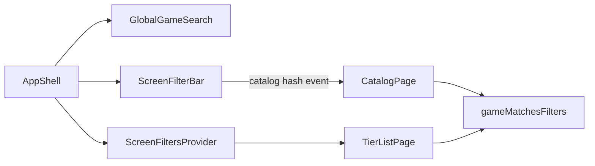

# Screen Filter Bar Implementation Plan

> **For agentic workers:** REQUIRED SUB-SKILL: Use superpowers:subagent-driven-development (recommended) or superpowers:executing-plans to implement this plan task-by-task. Steps use checkbox (`- [ ]`) syntax for tracking.

**Goal:** Restore header search on every screen and add an independent header filter field on catalog/tier roots that live-filters on-screen content.

**Architecture:** Split nav search (`GlobalGameSearch`) from on-screen filtering (`ScreenFilterBar`). Catalog filters stay in the hash; tier filters live in React session state via a small context provided by `AppShell`. Remove the sticky under-header `.app-search-bar`.

**Tech Stack:** React 19, Vitest + Testing Library, existing `CatalogSearchFilters` / `gameMatchesFilters`, CSS transitions.

**Spec:** [docs/superpowers/specs/2026-07-22-screen-filter-bar-design.md](../specs/2026-07-22-screen-filter-bar-design.md)

## Global Constraints

- Do not change `gameMatchesFilters` / `gameSearchScore` semantics.
- Catalog and tier filter state stay independent; tier filters are not URL-backed.
- Filter chrome lives in the header row (not under the header).
- Russian UI copy; placeholder `Фильтр…`.
- Respect `prefers-reduced-motion: reduce`.
- VCS: `git`; commit after each task.

## File map

| File | Role |
|------|------|
| `src/components/FilterMenu.tsx` | Extract shared facet dropdown |
| `src/components/ScreenFilterBar.tsx` | Header filter field + expand + facets |
| `src/components/screenFilters.tsx` | Tier filter session context |
| `src/components/GlobalGameSearch.tsx` | Nav-only search; drop catalog dual-mode + `layout="bar"` |
| `src/components/AppShell.tsx` | Always header search; mount filter on roots; provide tier context |
| `src/pages/TierListPage.tsx` | Apply filters; hide empty tiers when filtering |
| `src/components/SwipePager.tsx` | No API change required (context) |
| `src/styles.css` | Header filter expand; remove search-bar chrome |
| `src/components/index.ts` | Re-exports |
| Tests under `tests/` | New + updated |



---

### Task 1: Extract `FilterMenu`

**Files:**
- Create: `src/components/FilterMenu.tsx`
- Modify: `src/components/GlobalGameSearch.tsx` (import shared menu)
- Modify: `src/components/index.ts`
- Test: `tests/catalog-filter-dropdown.test.tsx` (still passes via GlobalGameSearch until Task 5)

**Interfaces:**
- Produces: `FilterMenu` with props `{ label: string; values: string[]; selected: string[]; renderLabel?: (value: string) => string; onChange: (values: string[]) => void }`
- Class names: `filter-menu` on `<details>`, `filter-menu__panel` on panel (keep current markup/behavior)

- [ ] **Step 1: Move `FilterMenu` into its own file**

Copy the existing `FilterMenu` function from `GlobalGameSearch.tsx` (lines ~35–58) into `src/components/FilterMenu.tsx`. Export it. Drop the `global-game-search__filter` class from the shared component (use only `filter-menu`).

```tsx
import { useEffect, useRef } from "react";
import { Icon } from "./Icon";

export function FilterMenu({ label, values, selected, renderLabel = (value) => value, onChange }: {
  label: string;
  values: string[];
  selected: string[];
  renderLabel?: (value: string) => string;
  onChange: (values: string[]) => void;
}) {
  const detailsRef = useRef<HTMLDetailsElement>(null);
  const toggle = (value: string) => onChange(selected.includes(value) ? selected.filter((item) => item !== value) : [...selected, value]);

  useEffect(() => {
    const closeWhenOutside = (event: Event) => {
      const details = detailsRef.current;
      if (details?.open && event.target instanceof Node && !details.contains(event.target)) details.open = false;
    };
    document.addEventListener("pointerdown", closeWhenOutside);
    document.addEventListener("focusin", closeWhenOutside);
    return () => {
      document.removeEventListener("pointerdown", closeWhenOutside);
      document.removeEventListener("focusin", closeWhenOutside);
    };
  }, []);

  return (
    <details className="filter-menu" ref={detailsRef}>
      <summary>{label}{selected.length ? <b>{selected.length}</b> : null}<Icon name="chevron-down" size={16} /></summary>
      <div className="filter-menu__panel">
        {values.length
          ? values.map((value) => (
            <label key={value}>
              <input checked={selected.includes(value)} onChange={() => toggle(value)} type="checkbox" />
              <span><Icon name="check" size={14} /></span>
              {renderLabel(value)}
            </label>
          ))
          : <p>Пока нет вариантов</p>}
      </div>
    </details>
  );
}
```

- [ ] **Step 2: Wire GlobalGameSearch to import it**

```tsx
import { FilterMenu } from "./FilterMenu";
```

Remove the local `FilterMenu` definition. Keep using it inside the popover.

- [ ] **Step 3: Export from barrel**

In `src/components/index.ts` add: `export * from "./FilterMenu";`

- [ ] **Step 4: Run regression**

Run: `npx vitest run tests/catalog-filter-dropdown.test.tsx tests/global-game-search.test.tsx`
Expected: PASS (catalog filter tests still go through GlobalGameSearch catalog mode until Task 4–5)

- [ ] **Step 5: Commit**

```bash
git add src/components/FilterMenu.tsx src/components/GlobalGameSearch.tsx src/components/index.ts
git commit -m "$(cat <<'EOF'
refactor(ui): extract shared FilterMenu

EOF
)"
```

---

### Task 2: Tier filter context

**Files:**
- Create: `src/components/screenFilters.tsx`
- Create: `tests/screen-filters-context.test.tsx`
- Modify: `src/components/index.ts`

**Interfaces:**
- Produces:
  - `ScreenFiltersProvider({ children })`
  - `useTierFilters(): { filters: CatalogSearchFilters; setFilters: (next: CatalogSearchFilters) => void }`
- Session-only state; default `emptyCatalogSearchFilters()`; lost on full reload

- [ ] **Step 1: Write failing test**

```tsx
import { renderHook, act } from "@testing-library/react";
import { describe, expect, it } from "vitest";
import { ScreenFiltersProvider, useTierFilters } from "../src/components/screenFilters";
import { emptyCatalogSearchFilters } from "../src/domain/catalogSearch";

describe("useTierFilters", () => {
  it("holds independent session filter state", () => {
    const wrapper = ({ children }: { children: React.ReactNode }) => (
      <ScreenFiltersProvider>{children}</ScreenFiltersProvider>
    );
    const { result } = renderHook(() => useTierFilters(), { wrapper });
    expect(result.current.filters).toEqual(emptyCatalogSearchFilters());
    act(() => {
      result.current.setFilters({ ...emptyCatalogSearchFilters(), q: "zelda", statuses: ["playing"] });
    });
    expect(result.current.filters.q).toBe("zelda");
    expect(result.current.filters.statuses).toEqual(["playing"]);
  });
});
```

- [ ] **Step 2: Run test — expect FAIL**

Run: `npx vitest run tests/screen-filters-context.test.tsx`
Expected: FAIL (module missing)

- [ ] **Step 3: Implement context**

```tsx
import { createContext, useContext, useState, type ReactNode } from "react";
import { emptyCatalogSearchFilters, type CatalogSearchFilters } from "../domain/catalogSearch";

interface TierFiltersValue {
  filters: CatalogSearchFilters;
  setFilters: (next: CatalogSearchFilters) => void;
}

const TierFiltersContext = createContext<TierFiltersValue | null>(null);

export function ScreenFiltersProvider({ children }: { children: ReactNode }) {
  const [filters, setFilters] = useState(emptyCatalogSearchFilters);
  return <TierFiltersContext.Provider value={{ filters, setFilters }}>{children}</TierFiltersContext.Provider>;
}

export function useTierFilters(): TierFiltersValue {
  const value = useContext(TierFiltersContext);
  if (!value) throw new Error("useTierFilters requires ScreenFiltersProvider");
  return value;
}
```

- [ ] **Step 4: Run test — expect PASS**

Run: `npx vitest run tests/screen-filters-context.test.tsx`
Expected: PASS

- [ ] **Step 5: Commit**

```bash
git add src/components/screenFilters.tsx src/components/index.ts tests/screen-filters-context.test.tsx
git commit -m "$(cat <<'EOF'
feat(ui): add tier screen filter session context

EOF
)"
```

---

### Task 3: `ScreenFilterBar` component

**Files:**
- Create: `src/components/ScreenFilterBar.tsx`
- Create: `tests/screen-filter-bar.test.tsx`
- Modify: `src/components/index.ts`

**Interfaces:**
- Consumes: `FilterMenu`, `CatalogSearchFilters`, `useTierFilters` (tier mode), hash helpers (catalog mode)
- Produces: `ScreenFilterBar({ games: Game[]; mode: "catalog" | "tier" })`
- Catalog mode: read/write `#/games?…` + `CATALOG_FILTERS_EVENT` (same pattern as today’s `GlobalGameSearch` catalog path)
- Tier mode: read/write `useTierFilters()`
- Expand: click/focus → `is-expanded` class; facet sheet visible; Escape / blur-outside collapses when no nested filter menu open

- [ ] **Step 1: Write failing tests**

```tsx
import { fireEvent, render, screen } from "@testing-library/react";
import userEvent from "@testing-library/user-event";
import { describe, expect, it } from "vitest";
import { ScreenFilterBar } from "../src/components/ScreenFilterBar";
import { ScreenFiltersProvider } from "../src/components/screenFilters";
import type { Game } from "../src/domain/types";

const game: Game = {
  id: "11111111-1111-4111-8111-111111111111",
  title: "DuckTales",
  coverAssetId: null,
  steamAppId: null, importedVia: "manually", hoursPlayed: null,
  platforms: ["NES"], tags: ["platformer"], status: "playing",
  placement: { tierId: "a", rank: 1024 },
  reviewMarkdown: "",
  createdAt: "2026-07-16T10:00:00.000Z",
  updatedAt: "2026-07-16T10:00:00.000Z",
};

describe("ScreenFilterBar", () => {
  it("expands to show facet menus on focus", async () => {
    const user = userEvent.setup();
    window.location.hash = "#/games";
    render(<ScreenFilterBar games={[game]} mode="catalog" />);
    expect(screen.queryByText("Статус")).not.toBeInTheDocument();
    await user.click(screen.getByRole("searchbox", { name: "Фильтр игр на экране" }));
    expect(screen.getByText("Статус")).toBeInTheDocument();
    expect(screen.getByText("Тир")).toBeInTheDocument();
  });

  it("writes catalog hash on text change", async () => {
    const user = userEvent.setup();
    window.location.hash = "#/games";
    render(<ScreenFilterBar games={[game]} mode="catalog" />);
    await user.type(screen.getByRole("searchbox", { name: "Фильтр игр на экране" }), "Duck");
    expect(window.location.hash).toContain("q=Duck");
  });

  it("updates tier session filters without touching the hash", async () => {
    const user = userEvent.setup();
    window.location.hash = "#/";
    render(
      <ScreenFiltersProvider>
        <ScreenFilterBar games={[game]} mode="tier" />
      </ScreenFiltersProvider>,
    );
    await user.type(screen.getByRole("searchbox", { name: "Фильтр игр на экране" }), "Duck");
    expect(window.location.hash).toBe("#/");
  });
});
```

- [ ] **Step 2: Run tests — expect FAIL**

Run: `npx vitest run tests/screen-filter-bar.test.tsx`
Expected: FAIL (module missing)

- [ ] **Step 3: Implement `ScreenFilterBar`**

Key behavior:
- Root: `div.screen-filter-bar` + `is-expanded` when open
- Field: icon + `<input type="search" placeholder="Фильтр…" aria-label="Фильтр игр на экране" />` + optional clear
- When expanded: `div.screen-filter-bar__sheet` with four `FilterMenu`s + reset button when facet count > 0
- Catalog `update`: `history.replaceState` + `CATALOG_FILTERS_EVENT` only when hash is `#/games…`
- Tier `update`: `setFilters` from context
- Outside pointerdown collapses expand (ignore clicks inside open `details.filter-menu`)

Skeleton:

```tsx
export function ScreenFilterBar({ games, mode }: { games: Game[]; mode: "catalog" | "tier" }) {
  // catalog: local state synced from hash + event
  // tier: useTierFilters()
  // platforms/tags derived from games
  return (
    <div className={`screen-filter-bar${expanded ? " is-expanded" : ""}`} ref={rootRef}>
      <div className="screen-filter-bar__field" onClick={() => { setExpanded(true); inputRef.current?.focus(); }}>
        <Icon name="search" size={16} />
        <input /* ... */ placeholder="Фильтр…" />
      </div>
      {expanded ? (
        <div className="screen-filter-bar__sheet" role="dialog" aria-label="Параметры фильтра">
          {/* FilterMenus + reset */}
        </div>
      ) : null}
    </div>
  );
}
```

- [ ] **Step 4: Run tests — expect PASS**

Run: `npx vitest run tests/screen-filter-bar.test.tsx`
Expected: PASS

- [ ] **Step 5: Commit**

```bash
git add src/components/ScreenFilterBar.tsx src/components/index.ts tests/screen-filter-bar.test.tsx
git commit -m "$(cat <<'EOF'
feat(ui): add ScreenFilterBar for on-screen filters

EOF
)"
```

---

### Task 4: Make `GlobalGameSearch` nav-only

**Files:**
- Modify: `src/components/GlobalGameSearch.tsx`
- Modify: `tests/global-game-search.test.tsx`
- Modify: `tests/catalog-filter-dropdown.test.tsx` → retarget to `ScreenFilterBar`
- Modify: `tests/ui-acceptance.test.tsx` (hash sync cases that mount GlobalGameSearch + CatalogPage)

**Interfaces:**
- Remove `layout` prop
- Remove `is-catalog` / filters-only dialog path
- Keep local query state for typeahead; **do not** write catalog hash on every keystroke
- Keep “Показать все результаты” → `navigate(#/games?serialize(filters))` (one-shot navigation write)
- Always combobox + results list when open

- [ ] **Step 1: Update / replace failing catalog-mode tests**

In `tests/global-game-search.test.tsx`, **delete** the test `"uses the catalog itself as results and opens only the filter panel"`.

Move Safari/outside-close filter tests from `tests/catalog-filter-dropdown.test.tsx` to render:

```tsx
window.location.hash = "#/games";
render(<ScreenFilterBar games={[game]} mode="catalog" />);
await user.click(screen.getByRole("searchbox", { name: "Фильтр игр на экране" }));
// then exercise FilterMenu summaries as before
```

In `tests/ui-acceptance.test.tsx`, where StrictMode hash sync used `GlobalGameSearch` + `CatalogPage`, replace `GlobalGameSearch` with `<ScreenFilterBar games={games} mode="catalog" />`.

- [ ] **Step 2: Run tests — expect FAIL** on removed catalog dual-mode assumptions / missing ScreenFilterBar wiring in those files

Run: `npx vitest run tests/global-game-search.test.tsx tests/catalog-filter-dropdown.test.tsx tests/ui-acceptance.test.tsx`

- [ ] **Step 3: Simplify `GlobalGameSearch`**

- Drop `layout` prop and `global-game-search--bar`
- Drop `catalogHash` branching for input role / filters-only popover
- Local `filters` state starts from `emptyCatalogSearchFilters()` (not from location)
- On change: only `setFilters` (no `writeCatalogLocation`)
- Popover always shows filters + results + “Показать все результаты”
- `openCatalog` still `navigate(#/games?…)` with current local filters
- Opening a game clears local filters as today

- [ ] **Step 4: Run tests — expect PASS**

Run: `npx vitest run tests/global-game-search.test.tsx tests/catalog-filter-dropdown.test.tsx tests/ui-acceptance.test.tsx`
Expected: PASS

- [ ] **Step 5: Commit**

```bash
git add src/components/GlobalGameSearch.tsx tests/global-game-search.test.tsx tests/catalog-filter-dropdown.test.tsx tests/ui-acceptance.test.tsx
git commit -m "$(cat <<'EOF'
refactor(ui): make GlobalGameSearch navigation-only

EOF
)"
```

---

### Task 5: Wire `AppShell` — always search + header filter

**Files:**
- Modify: `src/components/AppShell.tsx`
- Create: `tests/app-shell-filter-chrome.test.tsx`

**Interfaces:**
- Consumes: `ScreenFilterBar`, `ScreenFiltersProvider`, `GlobalGameSearch`
- `showFilterBar = (activeTab === "tiers" || activeTab === "catalog") && atTabRoot`
- Always render search in header (never `.app-search-bar`)
- Wrap shell contents in `ScreenFiltersProvider`
- Header order: desktop nav (if any) → `ScreenFilterBar` (if show) → `GlobalGameSearch` → `app-header__actions`

- [ ] **Step 1: Write failing shell test**

```tsx
import { render, screen } from "@testing-library/react";
import { describe, expect, it, vi } from "vitest";
import { AppShell } from "../src/components/AppShell";

vi.stubGlobal("matchMedia", (query: string) => ({
  matches: query.includes("max-width") || query.includes("pointer: coarse"),
  media: query,
  addEventListener: () => {},
  removeEventListener: () => {},
  addListener: () => {},
  removeListener: () => {},
  dispatchEvent: () => false,
  onchange: null,
}));

describe("AppShell filter chrome", () => {
  it("keeps search in the header on catalog root and shows the filter field", () => {
    window.location.hash = "#/games";
    const { container } = render(
      <AppShell games={[]} onOpenDiff={vi.fn()} route="catalog" storage={{ bytes: 0, operationCount: 0 }}>
        <div>body</div>
      </AppShell>,
    );
    expect(container.querySelector(".app-search-bar")).toBeNull();
    expect(screen.getByRole("combobox", { name: "Глобальный поиск игр" })).toBeInTheDocument();
    expect(screen.getByRole("searchbox", { name: "Фильтр игр на экране" })).toBeInTheDocument();
  });

  it("hides the filter field off tab roots but keeps search", () => {
    window.location.hash = "#/games/x";
    render(
      <AppShell games={[]} onOpenDiff={vi.fn()} route="game" storage={{ bytes: 0, operationCount: 0 }}>
        <div>body</div>
      </AppShell>,
    );
    expect(screen.getByRole("combobox", { name: "Глобальный поиск игр" })).toBeInTheDocument();
    expect(screen.queryByRole("searchbox", { name: "Фильтр игр на экране" })).not.toBeInTheDocument();
  });
});
```

(Adjust `storage` prop shape to match `AppShellProps` exactly — copy from an existing AppShell test if present.)

- [ ] **Step 2: Run test — expect FAIL** (search still in `.app-search-bar` on mobile catalog)

Run: `npx vitest run tests/app-shell-filter-chrome.test.tsx`

- [ ] **Step 3: Update `AppShell`**

```tsx
const atTabRoot = route === "tiers" || route === "catalog" || route === "settings";
const showFilterBar = (activeTab === "tiers" || activeTab === "catalog") && atTabRoot;
const filterMode = activeTab === "catalog" ? "catalog" : "tier";

return (
  <ScreenFiltersProvider>
    <div className="app-shell" data-mobile-chrome={...} data-route={shellRoute} ref={ref}>
      <header className="app-header">
        {/* desktop nav */}
        {showFilterBar ? <ScreenFilterBar games={games} mode={filterMode} /> : null}
        <GlobalGameSearch games={games} onNavigate={onNavigate} />
        <div className="app-header__actions">{/* unchanged */}</div>
      </header>
      {/* REMOVE showSearchBar / .app-search-bar block */}
      <main>...</main>
      {/* tab bar */}
    </div>
  </ScreenFiltersProvider>
);
```

Remove `showSearchBar`, `searchLayout`, `data-search-bar`.

- [ ] **Step 4: Run test — expect PASS**

Run: `npx vitest run tests/app-shell-filter-chrome.test.tsx`
Expected: PASS

- [ ] **Step 5: Commit**

```bash
git add src/components/AppShell.tsx tests/app-shell-filter-chrome.test.tsx
git commit -m "$(cat <<'EOF'
feat(ui): header search everywhere plus screen filter bar

EOF
)"
```

---

### Task 6: Tier list live filtering

**Files:**
- Modify: `src/pages/TierListPage.tsx`
- Create: `tests/tier-list-filter.test.tsx`

**Interfaces:**
- Consumes: `useTierFilters()`, `gameMatchesFilters`
- When any filter active (`q` or facets): filter games before building tiers; **omit tier rows with zero games**
- When filters empty: current behavior (all tiers, including empty drop targets)
- DnD operates on the filtered visible set (same as today’s board ops on `games` prop subset)

- [ ] **Step 1: Write failing test**

Render `TierListPage` inside `ScreenFiltersProvider`, set filters via hook/button helper, assert non-matching cards gone and empty tiers absent.

```tsx
import { act, render, screen } from "@testing-library/react";
import { describe, expect, it } from "vitest";
import { ScreenFiltersProvider, useTierFilters } from "../src/components/screenFilters";
import { TierListPage } from "../src/pages/TierListPage";
import { emptyCatalogSearchFilters } from "../src/domain/catalogSearch";
import type { Game } from "../src/domain/types";

// two games in different tiers; set q to only match one
// expect the other tier section gone
```

Use a tiny setter child:

```tsx
function SetQ({ q }: { q: string }) {
  const { setFilters } = useTierFilters();
  return <button type="button" onClick={() => setFilters({ ...emptyCatalogSearchFilters(), q })}>set</button>;
}
```

- [ ] **Step 2: Run test — expect FAIL**

Run: `npx vitest run tests/tier-list-filter.test.tsx`

- [ ] **Step 3: Implement filtering in `TierListPage`**

```tsx
const { filters } = useTierFilters();
const deferred = useDeferredValue(filters);
const filtering = Boolean(deferred.q.trim() || deferred.statuses.length || deferred.tiers.length || deferred.platforms.length || deferred.tags.length);
const visibleGames = useMemo(
  () => games.filter((game) => gameMatchesFilters(game, {
    query: deferred.q, statuses: deferred.statuses, tiers: deferred.tiers,
    platforms: deferred.platforms, tags: deferred.tags,
  })),
  [deferred, games],
);
// use visibleGames instead of games for baseItems / rendering
// when mapping TIER_IDS → rows: if (filtering && !byTier[tierId].length) return null;
```

Wrap page usage in provider is already done by AppShell; unit test provides its own provider.

- [ ] **Step 4: Run test — expect PASS**

Run: `npx vitest run tests/tier-list-filter.test.tsx`
Expected: PASS

- [ ] **Step 5: Commit**

```bash
git add src/pages/TierListPage.tsx tests/tier-list-filter.test.tsx
git commit -m "$(cat <<'EOF'
feat(ui): live-filter tier board from session filters

EOF
)"
```

---

### Task 7: CSS — header expand + remove search bar

**Files:**
- Modify: `src/styles.css`
- Modify: `tests/mobile-nav-css.test.ts`
- Modify: `tests/tier-wrap-css.test.ts`
- Modify: `tests/button-system-css.test.ts` (touch targets for filter field if asserted)
- Modify: `tests/catalog-density-css.test.ts` if it mentions search-bar

**Concrete CSS rules:**

```css
.screen-filter-bar {
  position: relative;
  flex: 1 1 auto;
  min-width: 72px;
  max-width: min(180px, 42vw);
  transition: max-width 220ms ease-out;
}
.screen-filter-bar.is-expanded {
  max-width: min(420px, 100%);
  flex: 1 1 100%;
  z-index: 5;
}
.screen-filter-bar__field { /* match global-game-search__field chrome */ }
.screen-filter-bar__sheet {
  position: absolute;
  top: calc(100% + 6px);
  left: 0;
  right: 0;
  /* glass/panel tokens already in theme */
  animation: screen-filter-sheet-in 180ms ease-out;
}
@media (prefers-reduced-motion: reduce) {
  .screen-filter-bar,
  .screen-filter-bar__sheet { transition: none; animation: none; }
}
```

Remove / neutralize:
- `.app-shell[data-search-bar="true"]` height bump
- `.app-search-bar` rules (or leave unused dead CSS deleted)
- Replace `var(--app-search-bar-height)` usages with `0px` removal: change padding/tier calcs back to `var(--app-header-height)` only

Update tests:
- `mobile-nav-css.test.ts`: assert **no** required `.app-search-bar` layout; assert `.screen-filter-bar` + `is-expanded` max-width transition present; padding-top uses header only
- `tier-wrap-css.test.ts`: drop `--app-search-bar-height` from expected calc strings

- [ ] **Step 1: Update CSS tests to new expectations (fail against old CSS)**

- [ ] **Step 2: Run CSS tests — expect FAIL**

Run: `npx vitest run tests/mobile-nav-css.test.ts tests/tier-wrap-css.test.ts`

- [ ] **Step 3: Edit `styles.css` as above; delete sticky search-bar chrome**

- [ ] **Step 4: Run CSS tests — expect PASS**

- [ ] **Step 5: Commit**

```bash
git add src/styles.css tests/mobile-nav-css.test.ts tests/tier-wrap-css.test.ts tests/button-system-css.test.ts tests/catalog-density-css.test.ts
git commit -m "$(cat <<'EOF'
style(ui): header filter expand, drop sticky search bar

EOF
)"
```

---

### Task 8: Full verification

- [ ] **Step 1: Run full suite**

Run: `npm test && npm run build`
Expected: all green

- [ ] **Step 2: Fix any stragglers** (grep for `app-search-bar`, `layout="bar"`, `is-catalog`, `data-search-bar`)

- [ ] **Step 3: Final commit only if fixes landed; otherwise done

---

## Spec coverage checklist

| Spec requirement | Task |
|------------------|------|
| Search on every screen | 4, 5 |
| Filter field in header on catalog/tier roots | 3, 5 |
| Adaptive width + expand animation + facet sheet | 3, 7 |
| Live filter catalog (hash) | 3 (writes) + existing CatalogPage |
| Live filter tier; hide empty tiers | 6 |
| Independent filter state | 2, 3 |
| Remove under-header search bar | 5, 7 |
| Nav search does not own on-page filter | 4 |
| Tests + verify | 1–8 |

## Self-review notes

- No TBD placeholders.
- `FilterMenu` signature stable across Tasks 1 and 3.
- Tier filters always via `useTierFilters` / `ScreenFiltersProvider` (AppShell wraps once).
- Catalog chips on `CatalogPage` remain; no change required beyond hash still working.
